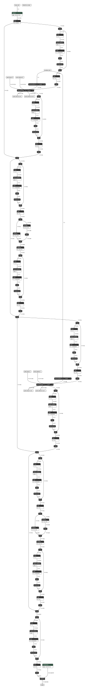
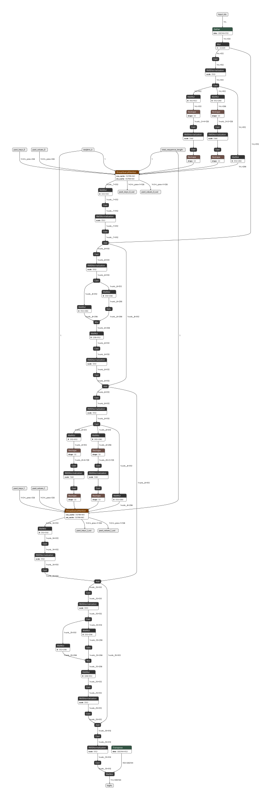
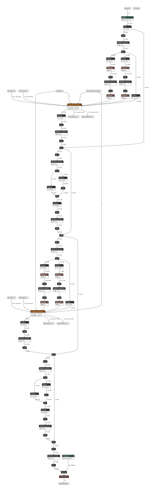
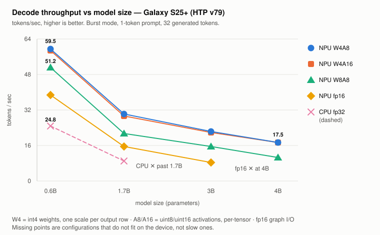

# hf2mobile

**Export HuggingFace `transformers` LMs into mobile-targeted ONNX graphs (ONNXRuntime CPU-EP, QNN-EP).**


```bash
hf2mobile-export    Qwen/Qwen3-0.6B --target ORT --export_dtype float32           # trace + ORT fusions, then bake in sampling + EOS ids -> inference.onnx
hf2mobile-inference 2026-08-01__ORT__Qwen-Qwen3-0.6B --prompt "Where is Paris?"   # rust runtime: graph + tokenizer, nothing else
```

---

## Table of Contents

- [Motivation](docs/motivation.md): why operator-level ONNX is no longer sufficient
- [Approach](docs/approach.md): the module boundary as the unit of export
- [How it works](docs/how-it-works.md): the export stages, and the Rust runtime that runs the result on a phone
- [Evaluation](docs/evaluation.md): NPU vs CPU decode throughput on a Galaxy S25+
- [Requirements](#requirements)
- [Install](#install)
- [Usage (CLI)](#usage-cli): export, postprocess and infer, on the host or over `adb`
- [Roadmap](#roadmap)

---

## Motivation

**[docs/motivation.md](docs/motivation.md)**: why operator-level ONNX is no longer sufficient.

ONNX standardized the operator level, which sufficed while the vocabulary stayed small and universal. Modern LLMs are stateful and autoregressive, and the ecosystem became plugin-centric in response: every runtime grew its own extensions (fused attention, runtime configs, session APIs) for the parts the standard vocabulary cannot express. Those extensions hold the performance, and they are also where portability stops. An export tuned for speed belongs to one runtime, and flattening it back to standard ONNX discards the speed.

---

## Approach

**[docs/approach.md](docs/approach.md)**: the module boundary as the unit of export.

Trace the model as its semantic modules (attention, RoPE, RMSNorm, the LM head) rather than as a flat operator graph, hold each module as a single node, and expand it per target at export time. The portable artifact is then the module-level trace rather than any file generated from it, and the NPU/CPU partition becomes an export-time decision instead of a property of whichever converter consumes the file.

---

## How it works

**[docs/how-it-works.md](docs/how-it-works.md)**: the export stages, and the Rust runtime that runs the result on a phone.

Seven stages: trace module I/O, export the subgraphs, register the plugin ops, export the prefill and generation cases, merge and fuse and postprocess, bake the decode policy into the graph, then run it. The runtime is two Rust crates over one engine: a Python extension module for the host, and a standalone `aarch64-linux-android` binary for the phone.

|  |  |  |  |
| :---: | :---: | :---: | :---: |
| Initial module-level graph | Postprocessed module-level graph | Flattened operator-level graph (ORT: CPU-EP target) | Decode policy baked in (`SampleLogits` + EOS ids) |

## Evaluation

**[docs/evaluation.md](docs/evaluation.md)**: `--target QNN` vs `--target CPU` decode throughput on a Galaxy S25+.




---

## Requirements

- Python **>= 3.12**
- [`uv`](https://docs.astral.sh/uv/) for dependency management
- A **Rust toolchain** and [`maturin`](https://www.maturin.rs/), required only to build from source. `hf2mobile` is a mixed Rust/Python project, and a build compiles the `_ortrs_binding` extension module.

Everything above comes from `flake.nix`; nothing needs to be installed globally:

```bash
# for development on host
nix develop

# for android deployment (installs additional few GB - NDK, adb, ...)
nix develop .#android
```

> Pre-built ONNXRuntime so for `arm64-v8a` can be downloaded from [onnxruntime-android AAR](https://repo1.maven.org/maven2/com/microsoft/onnxruntime/onnxruntime-android/) (Find `jni/arm64-v8a/libonnxruntime.so`).

---

## Install

### HostPC

For development:

```bash
nix develop
uv sync                     # Python dependencies
maturin develop --release   # compile the Rust extension into the venv
```

Re-run `maturin develop --release` after any change under `src/onnx_inferencer/`. Python imports the *installed* `.so`, so a bare `cargo build` will not be picked up.

For testing:

```bash
nix develop

# 1. Build the whl and so
maturin build --release -o dist/

# 2. Install
uv pip install dist/hf2mobile-0.1.0-cp312-abi3-linux_x86_64.whl
```

### Android

Nothing is *installed* on the device. One binary is cross-compiled and pushed (see [Usage](#usage-cli)):

```bash
nix develop .#android

# 1. Build the android so
cargo build --release --target aarch64-linux-android --bin hf2mobile-infer
file target/aarch64-linux-android/release/hf2mobile-infer # ELF 64-bit LSB pie executable, ARM aarch64, interpreter /system/bin/linker64, for Android 24

# 2. Install
D=/data/local/tmp/hf2mobile
ORT=1.27.0  # match the host: python -c 'import onnxruntime; print(onnxruntime.__version__)'
curl -sLO https://repo1.maven.org/maven2/com/microsoft/onnxruntime/onnxruntime-android/$ORT/onnxruntime-android-$ORT.aar
unzip -j onnxruntime-android-$ORT.aar 'jni/arm64-v8a/libonnxruntime.so' -d .
file libonnxruntime.so # ELF 64-bit LSB shared object, ARM aarch64, for Android 24, stripped
adb shell mkdir -p $D
adb push target/aarch64-linux-android/release/hf2mobile-infer libonnxruntime.so $D/
adb shell chmod +x $D/hf2mobile-infer
```

`.cargo/config.toml` points cargo and the `cc` crate at the NDK's API-24 clang. API 24 (Android 7.0) is the floor ONNXRuntime's own Android builds target. `llvm-strip` roughly halves the 9 MB if the push is slow. The same source built for the host is just `cargo build --release`.

---

## Usage (CLI)

Supported architectures: `LlamaForCausalLM`, `Qwen2ForCausalLM`, `Qwen3ForCausalLM`, `Gemma3ForCausalLM`.

### `hf2mobile.export`: HF to ONNX

Host work in both cases: a phone runs the graph, it does not produce one.

```bash
nix develop

hf2mobile-export {HF repo id} --target {ORT|QNN}
```

| Argument         | Description                                                              | Default |
| ---------------- | ----------------------------------------------------------------------- | ------- |
| `repo_id`        | Hugging Face repo id of the model to export.                            | required |
| `-t`, `--target` | Export target: `ORT` or `QNN`. Graph topology may change based on it.   | `ORT`   |
| `--export_dtype` | `float32` / `float16` / `bfloat16`. Casts the weights before tracing, fixing the exported graph's dtype. | the model's own dtype |
| `--debug`        | Force a tiny random-init model (2 layers) and DEBUG logging for a fast smoke test. Also keeps the intermediate graphs. | off |
| `--skip_postprocess` | Stop after the ONNX export, leaving the decode policy to a separate `python3 -m hf2mobile.postprocess {export dir}` run. | off |
| *(postprocess flags)* | `--top_k`, `--top_p`, `--temp`, `--eos_tokens`, `--keep_logits`, `-o`: the postprocess parser, reused here. | from `generation_config.json` |

Output lands in a timestamped `{date}__{target}__{model}/`:

```
2026-08-01__ORT__Qwen-Qwen3-0.6B/
├── case2.onnx + .data           the dynamic-L graph, serving prefill and decode both
├── inference.onnx + .data       case2 plus the baked-in decode policy, what you ship
├── tokenizer.json               the runtime does all the tokenizing
├── tokenizer_config.json        the chat template
└── generation_config.json       the sampling policy and EOS ids postprocess reads
```

Prefill and generation are traced separately, but the ORT deliverable is the one dynamic-`L` graph that serves both, so `case1.onnx` is deleted at the end. `--debug` keeps it, along with the module subgraphs.

### `hf2mobile.infer`: run it

The same engine backs both paths, and the flags below apply to both.

| Argument           | Description                                                                  | Default |
| ------------------ | ---------------------------------------------------------------------------- | ------- |
| `export_dir`       | A **postprocessed** export directory (must hold `inference.onnx`).           | required |
| `--prompt`         | User prompt.                                                                  | required |
| `--skip_template`  | Feed `--prompt` verbatim instead of through the tokenizer's chat template.    | off |
| `--num-generation` | Maximum tokens to generate.                                                   | `512` |
| `--intra-threads`  | ORT intra-op thread count.                                                    | one per core |

There are no sampling flags, because the policy is baked into the graph. Output streams to stdout, followed by prompt length, tokens generated, TTFT and tok/s.

<details>
<summary><b>HostPC</b>: run it in the venv</summary>

```bash
nix develop

hf2mobile-inference {export dir} --prompt "Where is Paris?"
```

```bash
# Gemma 3 (270M), end to end
hf2mobile-export google/gemma-3-270m-it --target ORT --export_dtype float32
hf2mobile-inference 2026-08-01__ORT__google-gemma-3-270m-it --prompt "Where is Paris?"

# Force greedy decoding regardless of what the model's config says
hf2mobile-export google/gemma-3-270m-it --target ORT --temp 0
hf2mobile-inference 2026-08-01__ORT__google-gemma-3-270m-it --prompt "Where is Paris?"
```

<video src="https://github.com/user-attachments/assets/b255c43b-6fc2-492e-9c11-580863fb1897" controls muted width="600">
  <a href="docs/hostpc_inference_example.webm">hostpc_inference_example.webm</a>: decoding in the venv on the host.
</video>

</details>

<details>
<summary><b>Android</b>: run it over <code>adb</code></summary>

The binary and `libonnxruntime.so` are already on the device from [Install / Android](#android), so only the export directory still has to go over:

```bash
nix develop .#android

D=/data/local/tmp/hf2mobile
adb push 2026-08-01__ORT__google-gemma-3-270m-it $D/
adb shell "$D/hf2mobile-infer $D/2026-08-01__ORT__google-gemma-3-270m-it \
           --prompt 'Where is Paris?' --num-generation 64"
```

<video src="https://github.com/user-attachments/assets/09c56d25-e712-47cf-9b71-379b1f004073" controls muted width="600">
  <a href="docs/android_inference_example.webm">android_inference_example.webm</a>: decoding on-device over <code>adb</code>.
</video>

</details>

---

## Roadmap

<details>
<summary><b>Click to expand</b>: what ships today, and what is next per axis</summary>

Checked items are in the current export path; the rest are ordered by priority within each group.

### QNN target (Qualcomm HTP)

- [ ] **ONNX to DLC.** Lower and compile per HTP target (v79, v81, ...), fetching the `EPContext` `.so` that makes a QNN export loadable on-device.
- [ ] **QNN-scheme quantization.** HTP prefers `u16` activations over `u8`.

### ORT target (ONNXRuntime)

- [ ] **More contrib-op fusions.** The rest of the layer-norm family beyond RMSNorm/GQA.
- [ ] **MoE and LoRA plugins.** Module exporters for expert routing and adapter weights.
- [ ] **Per-token control flow.** Mixture-of-Depths and early-exit decoders, the one axis in the [motivation](docs/motivation.md) with no answer in any runtime today.
- [ ] **NPU/CPU EP partition.** Fused attention on the CPU EP, statically-shaped blocks on the NPU EP, one session.
- [ ] **Multimodal support.** Vision-language models: a separately traced vision encoder feeding the decoder.
- [ ] **ORT-scheme quantization.**

### Quantization

Targeting `u16` activations for QNN instead of `u8`, to preserve accuracy on HTP.

- [ ] **SmoothQuant (`u8s8`).** Migrate activation outliers into the weights so both sides quantize cleanly.
- [ ] **SpinQuant / QuaRot (`f16s8`).** Rotation-based outlier suppression, `R1` only (WoQ) first.
- [ ] **AWQ / GPTQ (`f16s8`).** Weight-only PTQ.

### Runtime and benchmarking

- [x] **Host-CPU runtime.** Rust ORT engine (`_ortrs_binding`): zero-copy KV cache, in-graph `SampleLogits`, TTFT/TPS per run.
- [x] **Loadable custom-op library.** `libhf2mobile_plugins.so`, the same operator for any other ORT binding.
- [x] **Android CLI.** `hf2mobile-infer`, a standalone `aarch64-linux-android` build with no Python, rendering the chat template itself.
- [ ] **Android CI / device verification.** The cross build is checked; a physical-device run, and the plugin `.so` an app would load, are still manual.
- [ ] **Benchmark harness.** Peak memory and a cross-target comparison, beyond TTFT/TPS.
- [ ] **More logits dtypes.** `SampleLogits` is fp32-only; fp16 needs one registration on each side.
- [ ] **Regression testing (pytest).** Extend `tests/`, including numerical parity against the `transformers` baseline.

</details>
