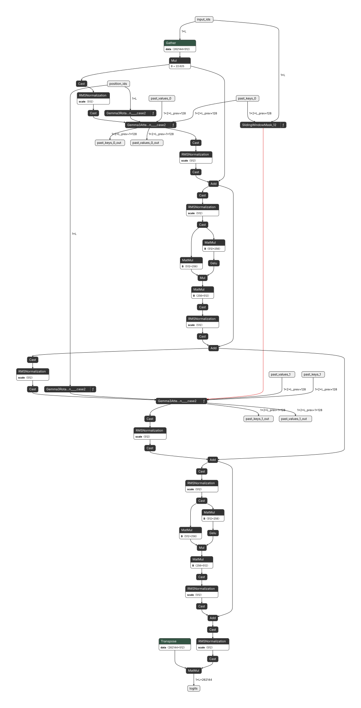
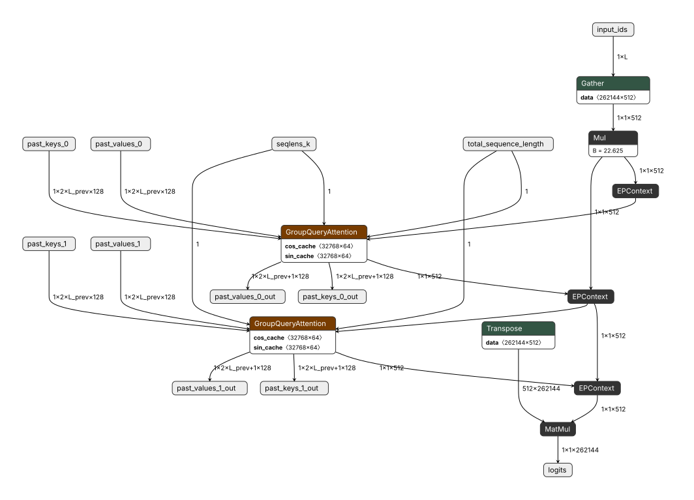

# 🧩 Approach

*The module boundary as the unit of export.* — [back to README](../README.md)

---

The [motivation](motivation.md) ends on a dilemma: the module level is where the performance lives, and — because it is plugin-centric — where portability stops.

Existing porting pipelines (Optimum, Olive, Qualcomm AI Hub) answer that fragmentation by deciding the expansion for you. Being community-driven, each settles on a strategy broad enough for the common cases. But a menu only covers what its authors anticipated, and extending it beyond that is difficult. How a module becomes a graph is fixed by the pipeline, precisely where a mobile target needs more flexibility:

- **KV caching strategy** — dynamic or padded, and in what tensor layout.
- **dtype management** — where mixed precision is allowed and where it is not.
- **execution-provider partitioning** — which subgraphs run on which backend.

`hf2mobile` hands those decisions back to you. Expansion becomes something you write rather than something you select, and that is what resolves the dilemma the motivation left open: performance and portability stop competing once the fast, target-specific export is no longer what you keep. What you keep is the module-level trace described below, and every target's file is generated from it. No one of those files becomes the artifact you are stuck with.

That is possible because `hf2mobile` is built **on top of HuggingFace `transformers`**, where every architecture follows the same prebuilt template (`Qwen3RMSNorm`, `LlamaAttention`, `Gemma3RotaryEmbedding`) — the module-level boundaries are already drawn by the library. Working one level up from the flat operator graph, at the **module boundary**, it supplies both a working mobile deployment pipeline and a baseline language for extending support to custom models and backends:

1. **Trace at the *module* level.** Rather than the conventional operator-level trace, the model is recorded as its semantic building blocks — Attention, RoPE, RMSNorm, the LM head. An `Attention` module enters the trace as a **single node**, with its identity intact (type: `Qwen3Attention`, name: `model.layers.0.self_attn`).
2. **Expand those nodes per target, per strategy.** The same node emits a fused GQA plugin for one runtime, a sliding-window mask template for another, or a single-head decomposition for an NPU with no fused attention — decided at export time.
3. **Extend the exporter API, don't pattern-match the graph.** Plugins are selected by class-name *suffix*, so one `Attention` exporter covers every architecture following the convention. Picking a target is a flag — `-t ORT`, `-t QNN` — and teaching the tool a new expansion rule is one small module in `src/hf2mobile/exporter/` that extends the existing APIs.

Here is what that looks like on a two-layer Gemma 3 export:

  
   
  every decoder layer keeps one <code>Gemma3Attention</code> node and one <code>Gemma3RotaryEmbedding</code> node, each carrying its class name into the graph — and the KV cache is threaded through named graph I/O (<code>past_keys_0</code> in, <code>past_keys_0_out</code> out) instead of being hidden inside a kernel

At this stage, nothing about *how* attention runs has been decided. What each node carries is a name, a signature, and its metadata — named I/Os, `head_size`, `hidden_dim`. These are the info later exporter reads when expanding.

## Example: placing the seam — one graph, more than one backend

A mobile SoC ships an NPU and a CPU on the same die, and the best performance comes from utilizing both at full capability. So the question is never which one to pick — it is **where to put the seam** between them.

Leave it to the runtime and the seam gets chosen for you. Hand an ONNX file to the [QNN execution provider](https://onnxruntime.ai/docs/execution-providers/QNN-ExecutionProvider.html) and it partitions the graph on its own: whatever the pattern matcher can claim is fused into `EPContext` nodes, and the rest falls back to CPU (`disable_cpu_ep_fallback = 0`, by default). Either way the seam is not yours: one unsupported op in the middle of a block can push the whole block off the accelerator, and tweaking the details of the IR is an unreliable way to steer it.

Held as *module-level* nodes at **export time**, the seam falls where you put it instead. The module boundary is the coarsest place to cut, not the only one: you decide how each node expands, so the seam can just as well run *inside* a module — QKV projections compiled onto the NPU while the cache append that follows them stays on the CPU. The node is the unit of control, not a wall.

**Shape is what you pick on.** An NPU EP earns its efficiency by compiling **ahead of time**, so every dimension must be known at build time; a CPU EP resolves shapes at runtime. Statically-shaped compute goes to the NPU — QKV projections, the MLP stack, where the TOPS are. Everything shape-dependent stays on the CPU, along with sampling, control flow, and any op the accelerator has no kernel for.

For example, Attention itself does not land on one side or the other. Encoder attention is static, decoder attention is not, so the two go to different processors:

| Attention | Shape | Goes to | Expanded into |
| --------- | ----- | ------- | ------------- |
| **Encoder / vision** | no cache, fixed sequence length — as static as the projections around it | **NPU** | split head subgraph as NPU lacks 5d support |
| **Decoder** | threads a KV cache whose `total_sequence_length` grows by one per step | **CPU** | `GroupQueryAttention`, so ORT owns the in-kernel cache append and the state stays visible in the IR as ordinary `past_key` / `present_key` IO buffers |

Two nodes of the same kind, expanded differently due to the dynamic properties of each subgraph.

> [!NOTE]
> The decoder row is this target's call, not a law. Pad the cache to a fixed length and it compiles AOT too (what Qualcomm's AIHUB SDK does), buying static shape with wasted compute and a capped context.

Either way the expansion is decided in the exporter.

This is the same graph from earlier, one step later. `Gemma3Attention` has expanded into `GroupQueryAttention` on the CPU side. Both halves still ship as one file: an `EPContext` node embeds the compiled NPU partition inside the same ONNX graph. One graph, one session, mixed execution.

  
   
  the same export, with every statically-shaped run collapsed into an <code>EPContext</code> node — 79 nodes become 9, and the two <code>GroupQueryAttention</code> nodes stay on the CPU side with their <code>past_keys_0</code> / <code>past_keys_0_out</code> I/O intact.

## The plugin node is the unit of control

Nothing above required a new file format — both expansions came out of the same kind of traced `Attention` node, and neither is privileged. That is why the node is held whole until the last step: the HuggingFace module stays the baseline, and every expansion is a deliberate departure from it, not whatever a converter's pattern matcher recognized in an already-flattened graph.

Attention is one of the four axes [motivation](motivation.md) opened; the same lever reaches the others. An MoE block held whole is one description that expands into `com.microsoft.MoE`. A LoRA adapter attaches at a module boundary by definition: merged into the weights for one target, left as a graph input for another. Mixture-of-Depths is the honest limit — a trace records the execution it saw, so per-token skipping survives no export at any boundary — but the node still names the block a custom kernel would have to claim, which a flattened graph does not.

> The portable artifact is the module-level trace, not any file it produces. A graph carrying a runtime-specific plugin or fusion pattern is bound to that runtime — but every target's file can be translated from the same module-level expansion.

That resolves the opening dilemma — not by making the fast export portable, but by keeping the two apart. Every emitted file stays bound to its runtime; the trace is what moves. The cost: the trace is `hf2mobile`'s own representation, which no other tool reads, so the per-*(hardware × runtime)* work is collapsed into one place rather than standardized away. The description is what gets versioned; every runtime-bound file is regenerated from it rather than maintained.

Being plugin-centric stops being a trap once what you keep is the description, not any one expansion of it.

## A descriptive graph, and a generic runtime to read it

The exporter and the runtime are one deliverable, designed against each other. Module identity is the *exporter's* lever; what the **runtime** needs is narrower but just as explicit — cache slots are named, and the sampling policy and EOS ids are [baked in](../README.md#2-hf2mobilepostprocess--bake-in-the-decode-policy). The Rust runtime ([CausalLM inferencer](how-it-works.md#example-causallm-inferencer)) reads all of that out of the file, which is what keeps it small and model-agnostic. The semantics live in **one artifact, in the IR**, instead of spread across a contrib op, a side-car config and a session API.

Attention shows the division: `GroupQueryAttention` owns the in-kernel cache append, so the export targets it directly; the loop around it — prefill, decode, stop — is host work, and the runtime owns that. One loop runs every exported model, small enough to cross-compile for a phone.

---

> [!IMPORTANT]
> **The module boundary is the unit of export because it is the last place where a model is still described rather than committed.** Above it, `transformers` has already drawn the boundaries. Below it, every choice — which kernel, which cache layout, which processor — has been made and can no longer be revisited. Holding the model at that boundary until the last step is what lets one trace serve targets that share no vocabulary, and what turns each new *(hardware × runtime)* cell into one exporter rather than one rewrite.

**Next:** [🔧 How it works](how-it-works.md) — the export stages, and the Rust runtime that runs the result on a phone.
